# Vaura — OLED screen mockups

Every screen state from `src/ui.cpp`, rendered from the exact `drawStr()`/`drawHLine()` pixel
coordinates used in the firmware — not an approximation. The mounted 0.96" panel is a **two-tone
OLED**: the top 16 pixel rows only light up yellow, the rest blue. The header and separator line
deliberately sit in the yellow strip; every list and content area starts right at pixel row 16
(see the comment above `renderIdle()` in `ui.cpp`).

**Gestures:** ⚪ **short press** — tap and release · 🔘 **long press** — press and hold ·
⚪⚪ **double click** — sends **ATTENTION!** instantly from any state (except the boot channel
prompt, which treats it as a confirm instead).

## Boot: channel selection

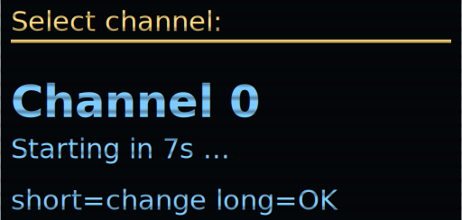

**First screen after power-on.** **Short press** cycles 0–9 (resets the countdown), **long press**
confirms; with no input the shown channel confirms itself after 10 s. The device sends **no
heartbeats** until confirmed; a double click confirms instead of firing a blind warning.

## Idle screen — rider list, weakest signal first

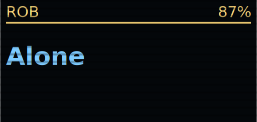 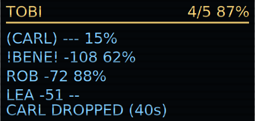

**Alone** — no other device heard yet. **Short press** opens the send menu, **long press** opens
settings.

**Up to 4 riders** — one row per rider, plus smoothed RSSI and the peer's battery from its
heartbeat (`--` if no INA219 is fitted there). Sorted by signal strength, **weakest first**. The
status lives in the name itself: `(CARL)` = dropped off — parenthesized like an absentee (RSSI
`---`, always sorted to the top; the last known battery value stays — 15% reveals a drained
battery), `!BENE!` = falling back (exclamation marks as the active warning), plain name = all
good. Header: `active/total` **including yourself**, plus your own battery.

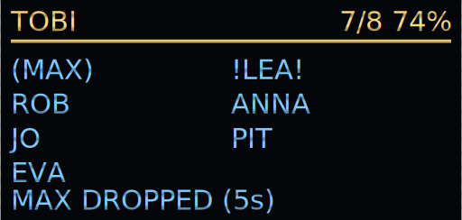 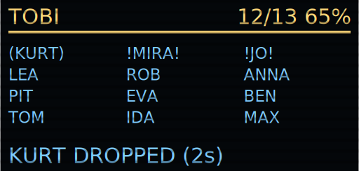

**5–8 riders** — two name columns, filled row by row (weakest top-left); the RSSI numbers give
way to the second column.

**9+ riders** — switches to the smaller 5×7 font, up to 15 names (5 rows). If not everyone fits,
**only the weakest are shown** — a strong signal doesn't need the space.

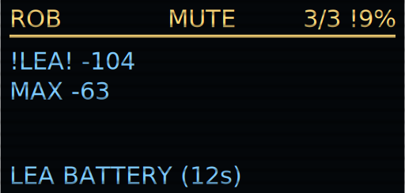

**MUTE** badge while alert beeps are switched off (settings, not persisted). The `!` before your
own percentage: battery under 3.5 V. The event line shows LEA's battery (from her heartbeat)
running low.

## Send menu, incoming warning & drop-off prompt

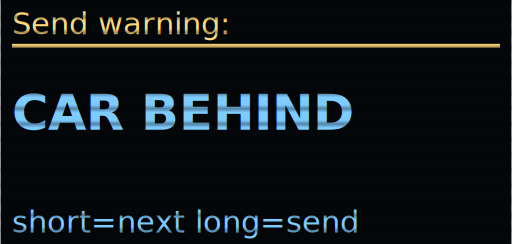

**Send menu.** **Short press** from the idle screen opens it. Further short presses cycle through
the four warnings; **long press** sends. If sending fails (duty cycle/radio), `! NOT sent` appears
plus a single beep.

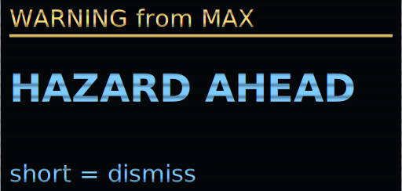

**Incoming warning.** Takes over the screen immediately, even mid-menu. **Short press** dismisses
it — there is no acknowledgement, nothing is sent back.

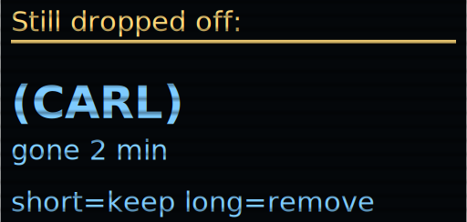

**"Still dropped off" prompt.** Appears from the **second** reminder onward (every 60 s, only over
the idle screen). **Long press** removes the rider from the group — they stop counting, showing,
and reminding, but come back **automatically** once their heartbeat arrives again. **Short
press**/timeout keeps them.

## Settings, stats & channel

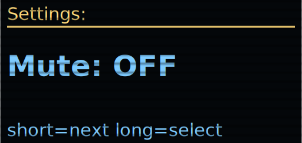

**Settings.** Opened via **long press** from idle. **Short press** cycles Mute → Stats → Tone →
Display → Sensitivity → Channel → Name → Test → Back; **long press** opens the shown item (for
Mute: toggles immediately, stays in the menu).

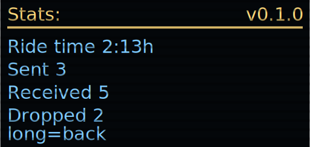

**Stats.** The current tour since power-on: ride time, warnings sent/received, drop-offs.
Deliberately not persisted — every tour starts at zero. Firmware version top right. **Long press**
back.

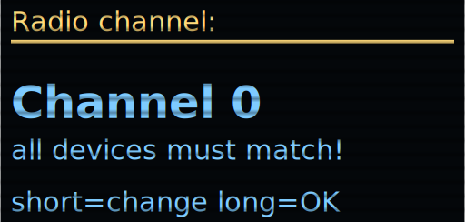

**Channel.** Radio group channel 0–9 (sync-word offset): different channels **never** hear each
other — every device on a ride must be set the same. **Long press** saves and switches
immediately. Default: 0.

## Tone, sensitivity & display timeout

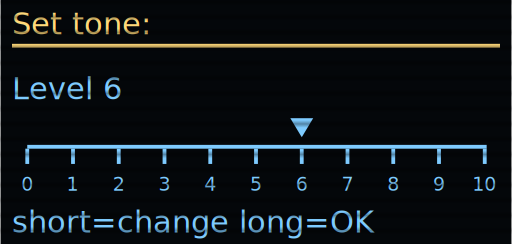

**Set tone (ruler scale).** Frequency as **level 0–10** (level = (Hz−2500)/100, default 3000 Hz =
level 5). **Short press**: next level + test beep (even while muted); **long press** saves; 6 s of
inactivity discards. The Hz value is what's actually stored in flash.

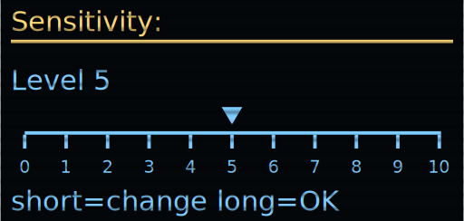

**Sensitivity (falling-back threshold).** Same ruler scale: level 0 = −120 dBm ≈ **practically
off**, level 5 = −105 dBm = **default** (middle), level 10 = −90 dBm = **very early** (3 dB per
level). Drop-off detection is unaffected. **Long press** saves; 6 s of inactivity discards.

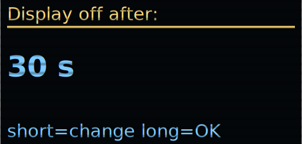

**Display (auto-off timeout).** **Short press** cycles Never → 15 s → 30 s → 1 min → 5 min; **long
press** saves permanently. **Never** keeps the display on all the time — costs noticeably more
battery. Default: 30 s.

## Changing the name

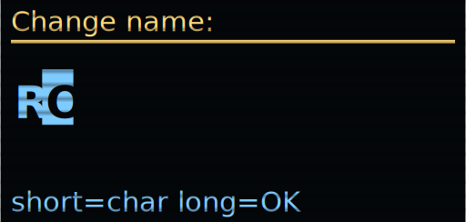

**Change name.** Opened via Settings → Name, starts empty (5 positions). **Short press** cycles
the marked character through A–Z only. **Long press** confirms and moves to the next, empty
position — two empty positions in a row or 5 characters save automatically (right-trimmed).

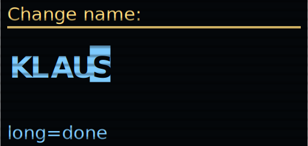

**"long=done" hint.** As soon as the next long press would save — here: the 5th character is
reached, same for two spaces in a row — the footer switches from `short=char long=OK` to this
unambiguous hint.

## Range test

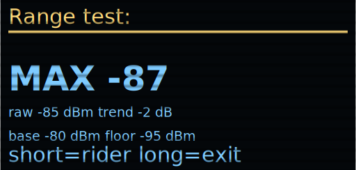

**Range test.** Settings → Test. Live: the smoothed RSSI (the value the falling-back logic judges)
large, then two small lines — raw RSSI and the trend (fast − slow, in dB) for that rider, then the
group's self-calibrated baseline and the floor currently being judged against (see
`src/calibration.{h,cpp}`). **No** timeout, **no** display sleep — exit only via **long press**.
The field tool for watching the self-calibrated floor track real conditions.

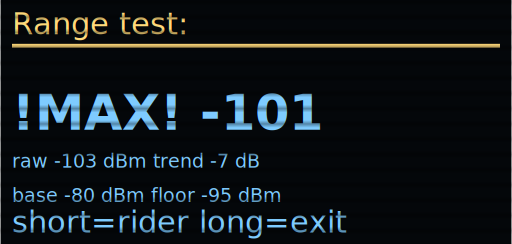

**Range test: falling back.** The big readout is marked `!NAME!` — the same convention as the idle
screen's rider list, but reflecting *this device's own* local verdict, not the group-corroborated
one (this screen exists to calibrate the local heuristic itself).

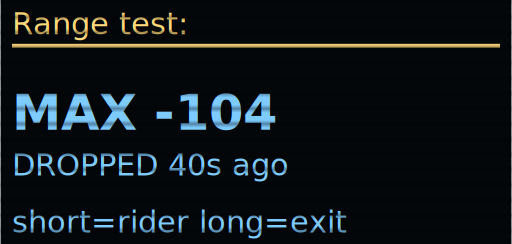

**Range test: dropped off.** If the watched rider has dropped off, the big readout is marked
`(NAME)` and the first detail line shows `DROPPED` plus the age of the last heartbeat — the
baseline/floor line keeps showing, since both are properties of the group, not of this one peer.

## Charging screen

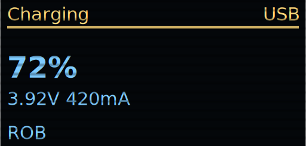

**Charging.** Entered automatically once the INA219 senses real charge current flowing into the
battery — not just USB power being present, so a battery-less test device plugged into USB stays in
normal operation instead. For as long as this is shown, radio, heartbeat, gossip and roster are all
suspended and the CPU is downclocked, to minimize power draw while plugged in. Shows battery
percent, voltage, charge current, and your nickname. Sleeps after a fixed **10 s**, independent of
the normal Display timeout setting (even if that's set to "Never") — any button press reactivates
it for another 10 s. No other gestures: the emergency double click is disabled while the radio is
suspended.
